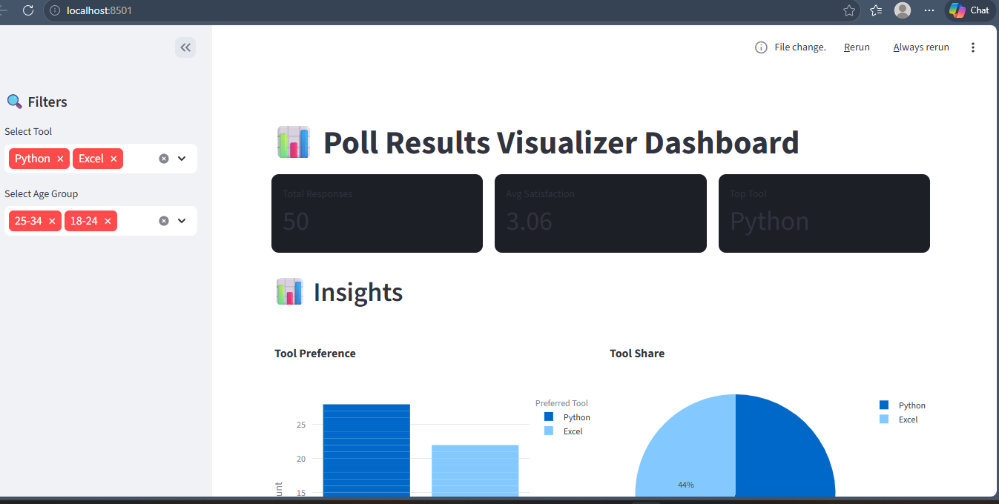
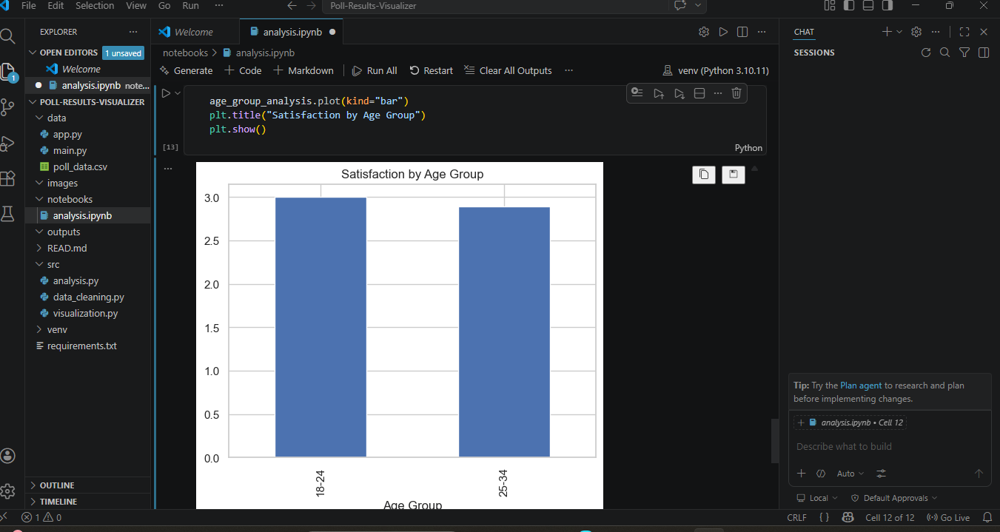
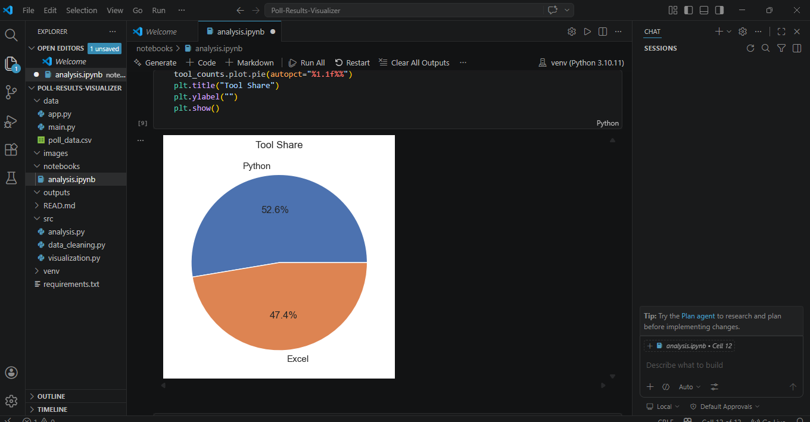
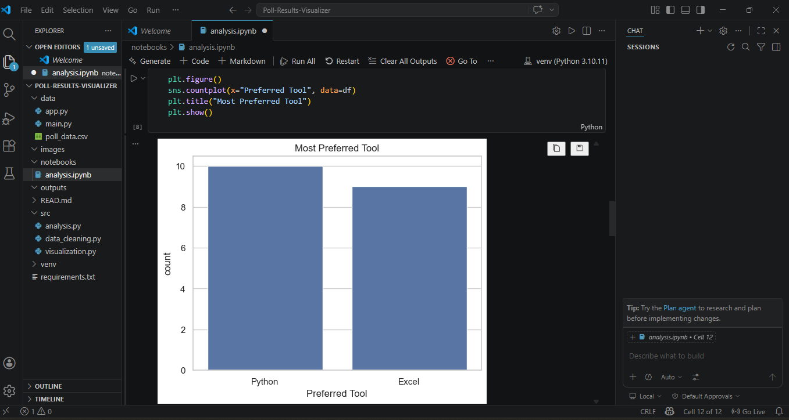
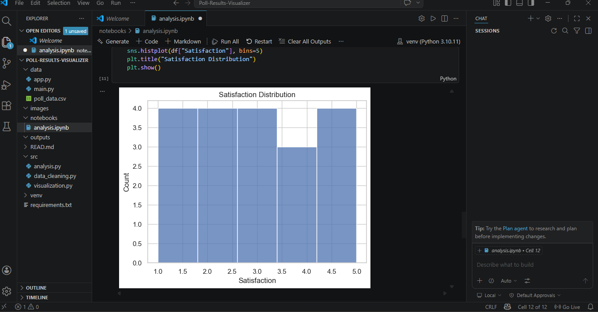
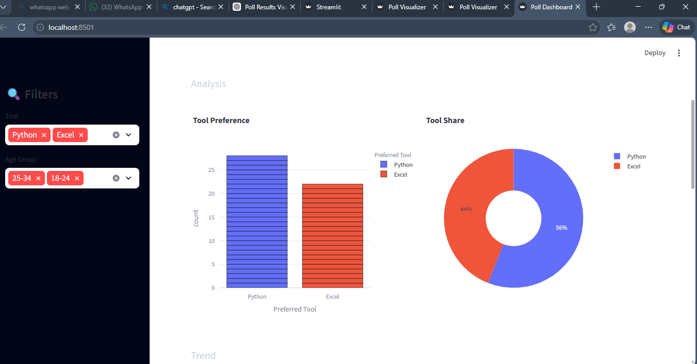

# 📊 Poll Results Visualizer



---

## 🚀 Overview

The **Poll Results Visualizer** is a data analytics project designed to transform raw survey or poll data into meaningful insights through data cleaning, analysis, and interactive visualizations.

This project demonstrates how real-world organizations analyze feedback data to support **data-driven decision-making**.

---

## 🎯 Problem Statement

Raw poll/survey data is:

* Difficult to interpret in raw format
* Time-consuming to analyze manually
* Not useful for quick decision-making

---

## 💡 Solution

This project builds a complete pipeline that:

* Cleans and preprocesses poll data
* Performs exploratory data analysis (EDA)
* Generates insightful visualizations
* Provides an interactive dashboard using Streamlit

---

## ✨ Features

* 📂 Data Cleaning & Preprocessing
* 📊 Exploratory Data Analysis (EDA)
* 📈 Trend Analysis (Time-Series)
* 📉 Distribution Analysis (Histogram)
* 📊 Interactive Dashboard (Streamlit)
* 🔍 Filter-based Insights
* 📸 Visual Outputs & Reports

---

## 🛠️ Tech Stack

* **Programming:** Python
* **Data Processing:** Pandas, NumPy
* **Visualization:** Matplotlib, Seaborn, Plotly
* **Dashboard:** Streamlit

---

## 📁 Project Structure

```
Poll-Results-Visualizer/
│
├── data/                # Raw and cleaned datasets
├── notebooks/           # Jupyter notebooks (EDA)
├── src/                 # Modular source code
├── outputs/             # Generated charts and results
├── images/              # Screenshots for README
│
├── app.py               # Streamlit dashboard
├── main.py              # Data pipeline script
├── requirements.txt     # Dependencies
└── README.md
```

---

## 📊 Visualizations

### 🔹 Tool Preference (Bar Chart)



### 🔹 Tool Share (Pie Chart)



### 🔹 Trend Analysis



### 🔹 Satisfaction Distribution



---

## 🧠 Key Insights

* Python is the most preferred tool among respondents
* Majority of users reported above-average satisfaction
* Clear patterns observed in response trends over time
* Demographic groups show variation in preferences

---

## ▶️ How to Run the Project

```bash
# Clone repository
git clone <your-repo-link>

# Navigate to project folder
cd Poll-Results-Visualizer

# Install dependencies
pip install -r requirements.txt

# Run dashboard
streamlit run app.py
```

---

## 📂 Dataset

The dataset contains:

* Age Group
* Gender
* Preferred Tool
* Satisfaction Rating
* Timestamp

Data is either:

* Collected via Google Forms
* Or synthetically generated for simulation

---

## 📸 Screenshots

### Dashboard Preview



### Filters & UI


---

## 🚀 Future Improvements

* Real-time poll data integration
* NLP-based sentiment analysis on feedback
* Advanced dashboard (Power BI / Tableau)
* User authentication system
* API integration for live polling

---

## 💼 Author

Tejaswini Ahire

---

## ⭐ Support

If you found this project useful, consider giving it a ⭐ on GitHub!
